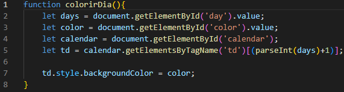
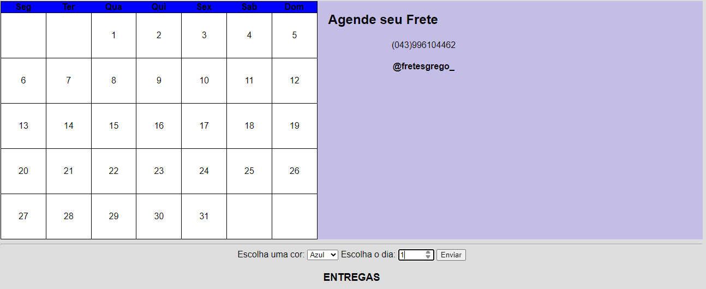

# calendario

# Tecnologias Ultilizadas
Nesse calendario, eu ultilizei os comandos 
* Visual Studio Code;
* CSS;
* Github;
* Git;
* html

### codigo javascript

# Descrição do meu site
eu fiz um calendario que tem 4 cores diferentes, e quando clicar em um numero do calendario, só selecionar a cor e o numero que mudará imediatamente, tem carros e caminhão de  frete e cada cor tem uma função para cada carro.

# funcionalidades
A funcionalidade do meu site é:
 * Marcação de dias no calendário para agendamento de fretes.

* facilitamento no processo de agendar fretes 
* legenda nas cores para identificar qual que é o veiculo

# Introdução 
A área de agendamento de fretes da empresa Alpha enfrenta o desafio de otimizar o uso da frota de veículos, garantindo que cada veículo seja alocado de forma eficiente, respeitando as restrições de disponibilidade e capacidade de cada um. Para isso, desenvolvemos um sistema de calendário que permite o agendamento dos fretes de maneira intuitiva, dando um alerta na tela do usuário quando é digitado um número menor que 1 ou maior que 30 (ex: -5, -2, 0, 35, 40). Facilitando o trabalho dos colaboradores e garantindo o cumprimento das regras estabelecidas pela empresa.

